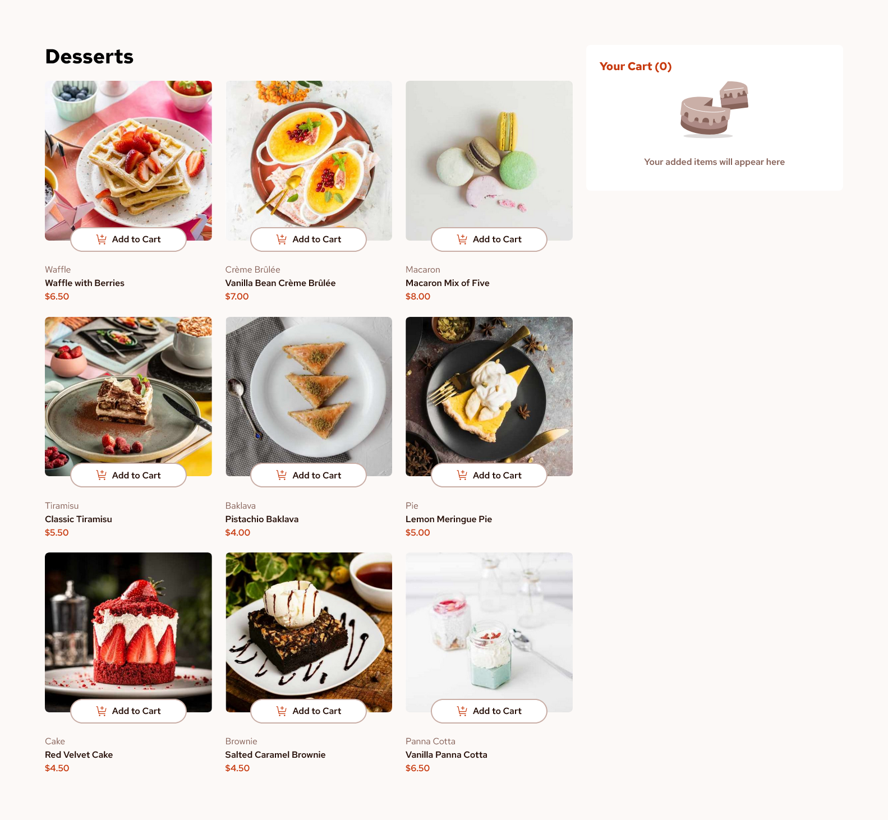
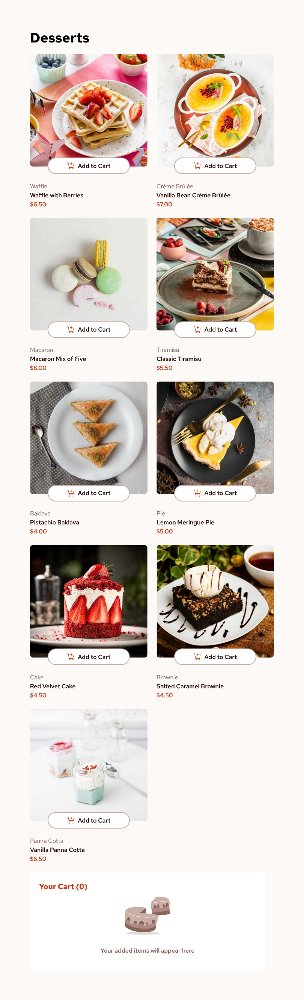
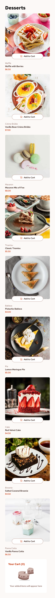

# Frontend Mentor - Product list with cart solution

This is a solution to the [Product list with cart challenge on Frontend Mentor](https://www.frontendmentor.io/challenges/product-list-with-cart-5MmqLVAp_d). Frontend Mentor challenges help you improve your coding skills by building realistic projects. 

## Table of contents

- [Frontend Mentor - Product list with cart solution](#frontend-mentor---product-list-with-cart-solution)
  - [Table of contents](#table-of-contents)
  - [Overview](#overview)
    - [The challenge](#the-challenge)
    - [Screenshots](#screenshots)
    - [Links](#links)
  - [My process](#my-process)
    - [Built with](#built-with)
  - [Author](#author)

## Overview

### The challenge

Users should be able to:

- Add items to the cart and remove them
- Increase/decrease the number of items in the cart
- See an order confirmation modal when they click "Confirm Order"
- Reset their selections when they click "Start New Order"
- View the optimal layout for the interface depending on their device's screen size
- See hover and focus states for all interactive elements on the page

### Screenshots

### Links

- Live Site URL: [https://naveerriaz.github.io/desserts-shop/](https://naveerriaz.github.io/desserts-shop/)

## My process

### Built with

- Semantic HTML5 markup
- Tailwind CSS
- Mobile-first workflow
- [React](https://reactjs.org/) - JS library

## Author

- Frontend Mentor - [@NaveerRiaz](https://www.frontendmentor.io/profile/NaveerRiaz)